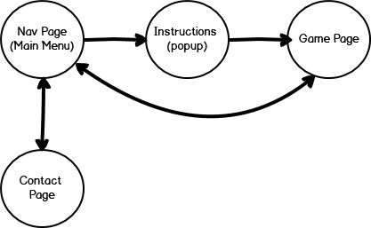

# KeyBeats
[Live Site]

This project has been designed as a webbased memory game. The **KeyBeats** project will showcase my ability to use HTML, CSS and Javascript
for my Milestrone Project 2.

## Project
My project will be a reflection of what i have learnt so far from the (Full Stack Developer course). KeyBeats is a memory game which introduces various instruments that will light up when randomly generated, 
players must then press the corresponding key in order to correctly select the instrument which is highlighted. 
The game will progressively speed up and the time allowed to select each instrument will decrease making for a challenging memory game.

The site is made up of three individual pages with a consistent background across all of them.
The three pages and their purposes are as follows:

- **Landing Page:** Simple design, eye catching image, navigation menu into the game.
- **Game Page:** Instruction modal popup to inform player on what to do and where to play game.
- **Contact :** Contact form for direct inquiry, feedback or ideas.

## UX
This site brings a web based game to the user and allows the player to easily navigate through from landing page to full game mode with only a single click of the mouse. 
Instructions are clearly outlined and are easy to find from the navigation menu on the home page. A contact form has also been added for queries, feedback or development ideas from players
 
### User Stories

- The user is able to enjoy playing the memory game.
- The user has the ability to contact creators with ideas, questions and feedback.
- The user will be instructed on how to play the game via a modal popup
- The user will be able to record their highest score in a local capacity

### Wireframes

The links below will take you to a PDF of each of the wireframes i have created for this project.

### Design Progression

## Features

Here is a list of the features included on the site. Along with possible additions later in order to develop the game.
**Features included:**
- Game Page where the game will be played
- Contact form submission, allowing users to give feedback based on experience.
- Instructions modal popup where detailed instructions in order to play will be given.
- Responsive design, with a landing page that works well across all platforms from desktop to mobile.
**Future features to be included at a later stage:**
- Multiple difficulty selections will add more variety to the game.
- Having the ability to pause the game will give users a better experience as they will be able to walk away and return whenever.
- Local highscores recorded from last use

## Technologies

Various different technologies have been used throughout my project, they are as follows:

- **Balsamiq** Rapid, effective and fun wireframing software.
- **Github** A cloud-based hosting service that lets you manage Git repositories.
- **Git**  A Distributed Version Control tool that is used to store different versions of a file in a remote or local repository.
- **Gitpod** An online IDE, providing a full working development environment.
- **Github Pages** GitHub Pages are public webpages hosted and easily published through GitHub.
- **Bootstrap** A front-end framework for developing responsive and mobile-first websites.
- **Markdown** A lightweight markup language with plain-text formatting syntax.
- **HTML5** Another markup language, predominantly used to structure and present content to the world wide web.
- **CSS3** Cascading style sheet language used in conjunction with HTML to create ontent and style.
- **JavaScript** is a text-based programming language used both on the client-side and server-side that allows you to make web pages interactive. 
- **jQuery** is a JavaScript library designed to simplify HTML DOM tree traversal and manipulation

## Testing

### HTML Validatior
Results from HTML validatior:

### CSS Validatior
Results from CSS validator - Errors shown in image below are due to Bootstrap framework.

### Browser Compatability
Browser compatability was tested across five different web browsers and these are:

- Google Chrome
- Mozilla Firefox
- Internet Explorer 11
- Safari
- Opera

The game was desinged using Google Chrome however functions on all browsers mentioned above. 

### Other testing

The webpage was submitted to the peer-code-review channel within the code institutes slack community.
This was extremely valuable for feedback from other mentors, module leads and students. It helped me to undersand what could be added or removed to make
the webpage more user friendly, as well as having access to feedback from a 'fresh set of eyes'.

## Deployment

**Github Pages**

## Credits

### Content

### Media
[The background image used across the game site](https://unsplash.com/photos/Ef96lad5ORk)

### Acknowledgements

